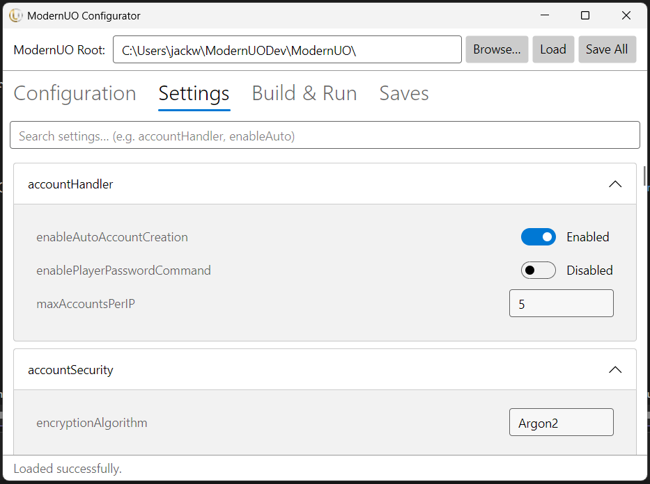
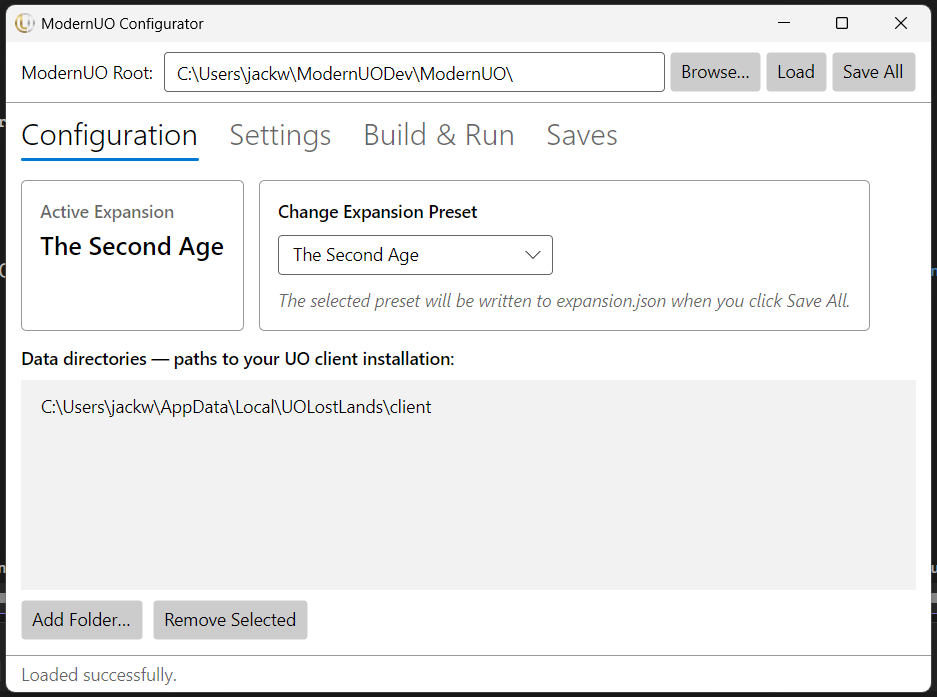
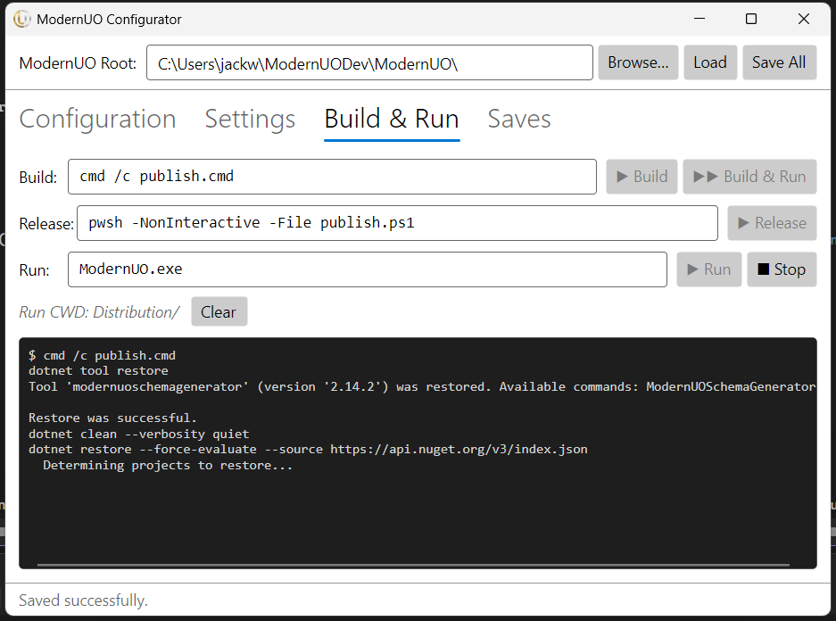
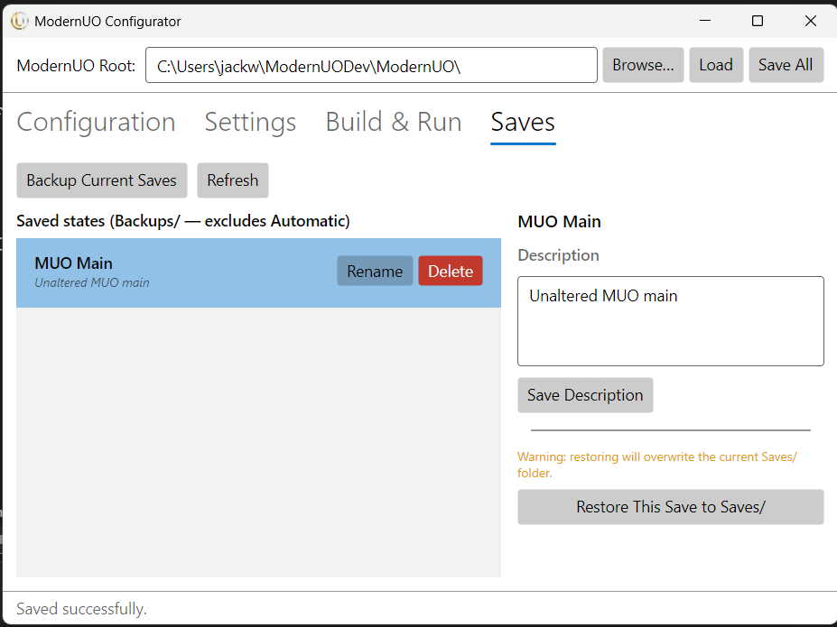

# ModernUO Configurator

A desktop GUI for configuring and running a [ModernUO](https://github.com/modernuo/ModernUO) server. Built with Claude in about an hour. Not robustly tested — use at your own risk.

Licensed under the [WTFPL](./LICENSE).

---

## Features

### Server Configuration
Edit `modernuo.json` settings directly from the UI. Settings are grouped by category and searchable. Changes are saved back to disk on any build/run action.



---

### Expansion Selector & Data Directories
Switch the server's active UO expansion (e.g. Renaissance, Age of Shadows, Mondain's Legacy) from a dropdown. Writes the correct `expansion.json` on save. Also manages UO client data directories used to load assets.



---

### Build & Run
One-click buttons to build, run, build-and-run, or publish a release build. Output is streamed live to a console panel in the UI. A Stop button kills the server process.

| Button | What it does |
|---|---|
| Build | Runs `publish.cmd` |
| Run | Launches `ModernUO.exe` |
| Build & Run | Build first, then launch if successful |
| Release | Runs `publish.ps1` for a release build |



---

### Save Management
Browse, backup, restore, rename, and delete server save snapshots. Backups live in `Distribution/Backups/` and can each have an optional description.



---

## Requirements

- [.NET 10 SDK](https://dotnet.microsoft.com/download)
- A local clone of [ModernUO](https://github.com/modernuo/ModernUO)

## Running

```
cd ModernUOConfigurator
dotnet run
```

The app will auto-detect the ModernUO root folder if run from inside the repo. Otherwise use the Browse button to point it at the folder containing `ModernUO.sln`.
